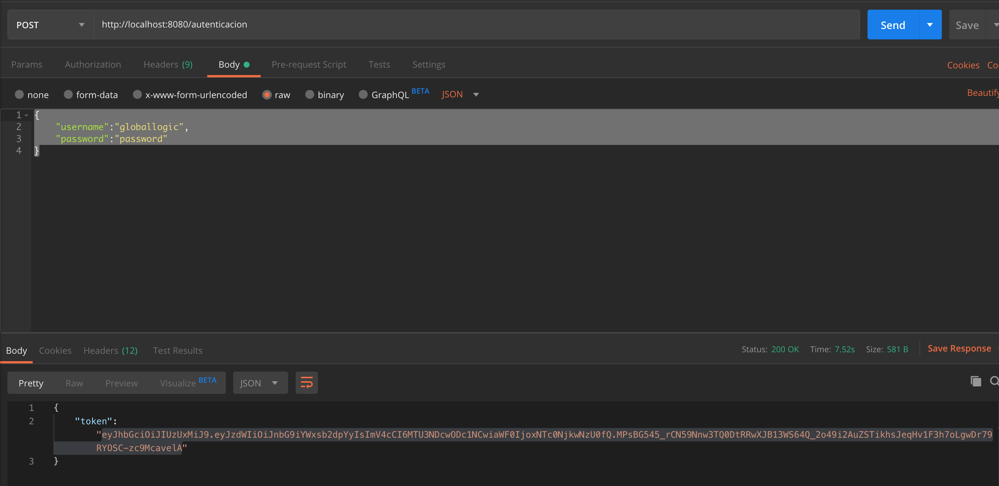
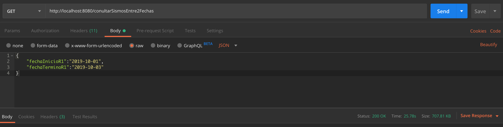
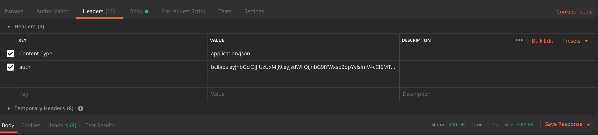
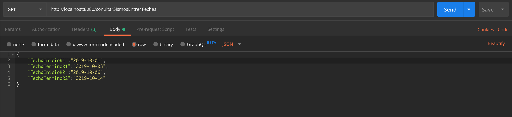
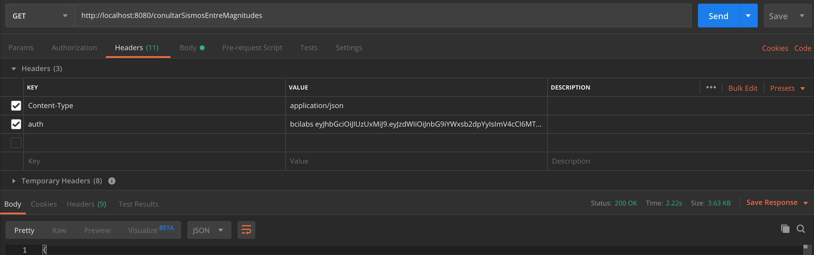
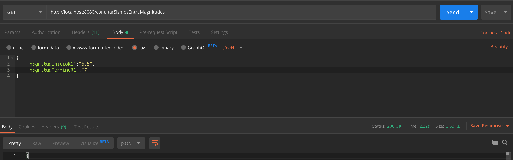

# globallogic-test
#INFO

##Despliegue de la aplicacion

- Ejecutar gradle task "bootJar"
- Ir a la ruta del jar generado y ejecutar siguiente comando:
- java -jar technicaltest-0.0.1-SNAPSHOT.jar

### Endpoint de autenticacion
http://localhost:8080/autenticacion

- JSON request:
- {
	"username":"globallogic",
	"password":"password"
}

### Endpoints de consulta sismos 2 fechas
- http://localhost:8080/conultarSismosEntre2Fechas
- Metodo Get
- Headers: Content-Type (application/json); auth (token)

- JSON request on Body:
- {
	"fechaInicioR1":"2019-10-01",
	"fechaTerminoR1":"2019-10-03"
}

### Endpoints de consulta sismos 4 fechas
- http://localhost:8080/conultarSismosEntre4Fechas
- Metodo Get
- Headers: Content-Type (application/json); auth (token)

- JSON request on Body:
- {	
	"fechaInicioR1":"2019-10-01",
	"fechaTerminoR1":"2019-10-03",
	"fechaInicioR2":"2019-10-06",
	"fechaTerminoR2":"2019-10-14"
}

### Endpoints de consulta sismos by magnitudes
- http://localhost:8080/conultarSismosEntreMagnitudes
- Metodo Get
- Headers: Content-Type (application/json); auth (token)

- JSON request on Body:
- {	
	"magnitudInicioR1":"6.5",
	"magnitudTerminoR1":"7"
}

